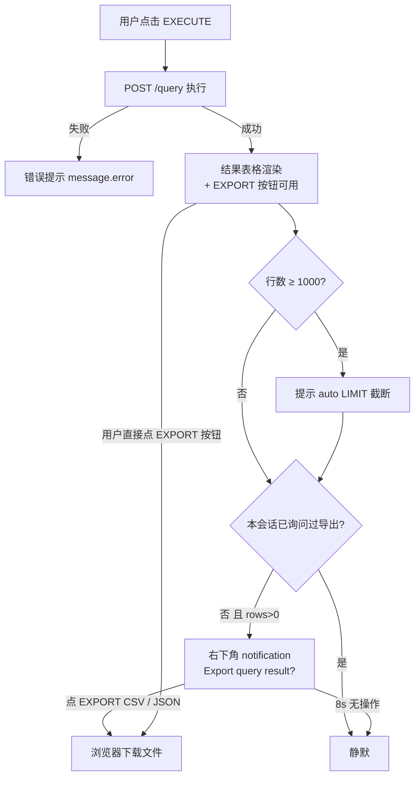

# 数据导出功能设计文档（CSV / JSON）

> **Feature Name**: Query Result Export（查询结果导出）
> **Domain**: db_query 数据库查询工作台
> **Related Docs**: [`docs/架构与开发指南.md`](./架构与开发指南.md) · [`CLAUDE.md`](../CLAUDE.md) · [`backend/app/adapters/README.md`](../backend/app/adapters/README.md)

---

## 一、文档信息

| 项目 | 内容 |
|---|---|
| 文档版本 | v1.0 |
| 状态 | Released（已实现并通过验收） |
| 作者 | db_query 项目组 |
| 创建日期 | 2026-08-14 |
| 变更记录 | v1.0（2026-08-14）：初版。新增后端导出 API、前端导出重构（BOM 修复）、Claude Code 自定义命令、双数据库（MySQL/PostgreSQL）联调验证 |

**读者对象**：产品经理、前后端研发、测试工程师、AI 工具链实践者。

---

## 二、产品需求（PRD）

### 2.1 背景与问题陈述

db_query 工作台此前仅支持在浏览器中查看查询结果，导出能力存在四处缺口：

| # | 问题 | 影响 |
|---|---|---|
| P1 | CSV 导出无 UTF-8 BOM，Excel 打开中文**乱码**（用户实测反馈） | 数据无法直接交付业务方 |
| P2 | 导出逻辑内联在 664 行的 `Home.tsx` 中，与 UI 耦合、无单测、无公式注入防护 | 维护成本高、有安全风险 |
| P3 | 仅前端本地导出，无服务端导出 API，命令行/Agent 无法复用 | 自动化链路断裂 |
| P4 | 查询与导出之间无交互引导，用户需自行发现导出按钮 | 功能可发现性差 |

### 2.2 目标与非目标

**Goals**

- G1: 查询结果可导出为 **CSV 与 JSON** 两种格式（UI 本地导出 + 服务端 API 导出双路径）；
- G2: 修复 CSV 中文乱码（UTF-8 BOM），Excel 双击即用；
- G3: "执行查询 + 导出结果"可由 **AI Agent 一条命令完成**（Claude Code 自定义命令）；
- G4: 查询成功后 AI 助手**主动询问**是否导出（不打扰策略约束下）；
- G5: 导出逻辑抽取为纯函数模块，前后端双侧可测。

**Non-Goals**

- 不支持 Excel（xlsx）二进制格式（保持零依赖，未来可扩展）；
- 不支持流式/分页导出（当前规模上限 1000 行，内存内序列化足够）；
- 不改变只读安全模型（导出仍强制 SELECT-only + 自动 LIMIT）；
- 不做导出任务的异步队列与通知中心。

### 2.3 目标用户与用户故事

| Persona | 用户故事 | 对应能力 |
|---|---|---|
| 数据分析师（小林） | "我查询候选人数据后，希望直接下载 CSV 发给 HR，Excel 打开中文不乱码" | UI 导出 + BOM（G1/G2） |
| 后端开发（阿凯） | "我希望在终端或让 AI 一条命令把查询结果落成 JSON，接入我的脚本" | 导出 API + `/export-query` 命令（G3） |
| 学生/演示者（小明） | "我第一次用这个工具，不知道能导出，希望它主动告诉我" | 查询后主动询问（G4） |

**用户旅程（导出主路径）**：选择数据库 → 输入 SQL → EXECUTE → 结果区出现 →（右下角弹出"Export query result?"）→ 点击 EXPORT CSV → 浏览器下载 `<连接名>_<时间戳>.csv` → Excel 打开验证中文正常。

### 2.4 功能需求清单

| 编号 | 需求 | 优先级（MoSCoW） | 验收要点 |
|---|---|---|---|
| FR-01 | 前端结果区提供 EXPORT CSV / EXPORT JSON 按钮 | Must | 有数据时可下载；无数据提示 "No data to export" |
| FR-02 | CSV 带 UTF-8 BOM，Excel 打开中文不乱码 | Must | 文件前三字节 `EF BB BF` |
| FR-03 | CSV 符合 RFC 4180（逗号/引号/换行转义） | Must | 含特殊字符单元格正确加引号 |
| FR-04 | CSV 公式注入防护（`= + - @ \t \r` 开头字符串加 `'` 前缀，含 header 行） | Must | `=SUM(A1)` 不被执行；数值 `-5` 不受影响 |
| FR-05 | 后端提供 `POST /api/v1/dbs/{name}/export`（csv/json） | Must | 双库（MySQL/PG）×双格式实测 200 |
| FR-06 | 导出复用标准查询管线（SELECT 校验、自动 LIMIT、历史落库） | Must | 非 SELECT 400；历史中可见导出记录 |
| FR-07 | 查询成功后主动询问导出（notification，每会话至多一次） | Should | rows>0 才弹；8s 自动关闭；不再重复弹 |
| FR-08 | Claude Code 自定义命令 `/export-query` 三步完成导出 | Should | 参数缺失时主动询问而非猜测 |
| FR-09 | 导出文件名 `<连接名>_<UTC时间戳>.<格式>`，连接名白名单过滤 | Should | `my db/../evil` → `mydb`；空则 `export` |
| FR-10 | 结果触达 1000 行上限时明确提示截断风险 | Should | `X-Row-Count: 1000` + UI warning |

### 2.5 非功能需求（NFR）

| 编号 | 类别 | 要求 |
|---|---|---|
| NFR-01 | 性能 | 1000 行 × 10 列内序列化 < 100ms（内存操作，无网络往返） |
| NFR-02 | 安全 | 只读模型不变；CSV 注入防护；文件名注入防护；连接 URL 不出现在导出文件中 |
| NFR-03 | 兼容性 | CSV 兼容 Excel 2016+ / WPS / pandas；JSON 为 UTF-8 数组，`jq` 可直接解析 |
| NFR-04 | 可测试性 | 格式化逻辑为纯函数，前后端均有单测覆盖 |
| NFR-05 | 一致性 | 前端 UI 导出与后端 API 导出**结构同构**：BOM、RFC 4180 转义（含 header）、公式防护、尾部 CRLF、文件名规则一致；已知文本差异仅限跨通路数据表示（布尔 `True`/`true`、日期时间格式，两路径数据源不同所致），不破坏结构 |

### 2.6 现状差距分析

| 能力 | 改造前 | 改造后 |
|---|---|---|
| CSV BOM | ❌ 无（乱码根因） | ✅ 前后端均带 BOM |
| RFC 4180 转义 | ⚠️ 部分（无 `\r` 处理） | ✅ 完整 |
| 公式注入防护 | ❌ 无 | ✅ 前后端双侧 |
| 服务端导出 API | ❌ 无 | ✅ `POST /{name}/export` |
| 命令行/Agent 自动化 | ❌ 无 | ✅ `/export-query` 命令 |
| 主动询问导出 | ❌ 无 | ✅ notification（防打扰） |
| 导出逻辑位置 | 内联 Home.tsx（~80 行） | 前端 `utils/export.ts` / 后端 `services/exporter.py` 纯函数 |
| 单元测试 | ❌ 无 | ✅ 后端 17 用例 + 前端 13 用例 |

---

## 三、产品设计

### 3.1 交互流程



### 3.2 UI 变更说明

- **RESULTS 卡片右上角**：保留 EXPORT CSV / EXPORT JSON 两按钮，行为改走 `utils/export.ts`（带 BOM、转义、防注入）。
- **右下角主动询问**（新增）：`notification.open`，含图标、行数描述、两个操作按钮；`bottomRight` 摆放避免遮挡主内容；8 秒自动消失。
- **防打扰三层策略**：
  1. 模块级 `exportOfferShown` 标志——每次页面会话（刷新前）至多询问一次；
  2. 仅 `rows.length > 0` 时询问（空结果无导出价值）；
  3. 8s 自动关闭，忽略即代表"不需要"。
- **闭包陷阱规避**：notification 按钮回调**显式传入当次查询的 result 对象**（`handleExport("csv", result)`），而非读取 state——notification 存续期间用户可能再次执行查询，读 state 会导出"新查询"的数据，与用户在通知里看到的行数不符。

### 3.3 文件命名规则

`<连接名>_<UTC时间戳>.<格式>`，例：`interview-db_20260814T160140.csv`

- 连接名经白名单 `[A-Za-z0-9_-]` 过滤（`sample hr` → `samplehr`），防止路径穿越与非法文件名；
- 全部过滤后为空（如纯中文名）时回退 `export`；
- 前后端时间戳格式一致（`YYYYMMDDTHHMMSS`，UTC），保证两条导出路径产物同构。

---

## 四、技术设计

### 4.1 总体架构：三条导出路径

```mermaid
flowchart LR
    subgraph 路径A [路径 A：UI 本地导出]
        A1[Home.tsx<br/>EXPORT 按钮 / notification] --> A2[utils/export.ts<br/>toCsv/toJson 纯函数]
        A2 --> A3[Blob 下载]
    end

    subgraph 路径B [路径 B：服务端导出 API]
        B1[POST /dbs/name/export] --> B2[execute_query_with_service<br/>校验+执行+落历史]
        B2 --> B3[services/exporter.py<br/>纯函数格式化]
        B3 --> B4[Response 附件下载]
    end

    subgraph 路径C [路径 C：AI Agent 自动化]
        C1[/export-query 命令] --> C2[curl 调用路径 B]
        C2 --> C3[exports/ 目录落盘]
    end
```

| 路径 | 场景 | 数据通道 |
|---|---|---|
| A | 浏览器交互，零后端开销 | 前端内存 → Blob |
| B | API 消费方、需要服务端留痕（查询历史） | 后端执行 → HTTP 附件 |
| C | AI 工具链/命令行自动化 | B 的 API → 本地文件 |

### 4.2 API 规范

`POST /api/v1/dbs/{name}/export`

**请求体**（`ExportRequest`）：

```json
{ "sql": "SELECT first_name, current_title FROM candidates LIMIT 10", "format": "csv" }
```

| 字段 | 类型 | 约束 | 说明 |
|---|---|---|---|
| sql | string | min_length=1 | 仅接受 SELECT（sqlglot 校验） |
| format | `"csv" \| "json"` | Literal 枚举 | 非法值由 Pydantic 拒绝（422） |

**成功响应 200**（以 csv 为例）：

```
Content-Type: text/csv; charset=utf-8
Content-Disposition: attachment; filename="interview-db_20260814T160140.csv"
X-Row-Count: 3

EF BB BF first_name,current_title
张,高级后端工程师
...
```

**错误码**：

| 状态码 | 触发条件 | detail 示例 |
|---|---|---|
| 404 | 连接名不存在 | `Database connection 'x' not found` |
| 400 | SQL 校验失败（非 SELECT） | `Only SELECT queries are allowed` |
| 422 | format 非法 / sql 为空（Pydantic） | 字段校验错误体 |
| 500 | 数据库执行错误 | `Query execution failed: Table does not exist` |

设计要点：

- 端点放 `queries.py`（同 `/dbs/{name}` 资源域），复用 `_get_connection_or_404` 帮助函数；
- 非 `response_model`，返回 `fastapi.Response`（文件下载语义），上限 1000 行无需 StreamingResponse；
- `X-Row-Count` 自定义头供客户端/UI 判断截断（==1000 即触达上限）；
- 复用 `execute_query_with_service` 六参管线——**导出行为与查询行为完全一致**（校验、自动 LIMIT、成功/失败均落查询历史，每库保留 50 条）。

### 4.3 数据结构（DTO）

```python
# backend/app/models/schemas.py
class ExportRequest(BaseModel):
    """Input schema for exporting query results as a downloadable file."""
    sql: str = Field(..., min_length=1, description="SQL SELECT query to execute")
    format: Literal["csv", "json"] = Field(..., description="Export file format")
```

前端复用既有 `types/query.ts` 的 `QueryResult`（消除原先在 `Home.tsx` 内的重复接口定义）。

### 4.4 核心算法说明

**（1）CSV 序列化（RFC 4180 + BOM）**

- `csv.writer(QUOTING_MINIMAL)`（后端）/ 手写转义（前端，与后端行为一致）：仅当单元格含 `,` `"` `\n` `\r` 时加引号并双写引号；
- 行终止符 CRLF（RFC 4180 规定）；
- 文件头注入 `EF BB BF`（UTF-8 BOM）：Excel 依据 BOM 识别 UTF-8，是中文不乱码的业界标准做法（JSON **不加** BOM——会破坏 `jq` 等解析器）。

**（2）CSV 公式注入防护（OWASP）**

```
危险前缀 = ( "=", "+", "-", "@", "\t", "\r" )
若 cell 是字符串 且 以危险前缀开头 → 输出 "'" + cell
```

- 仅处理**字符串类型**：数值 `-5` 保持原样（否则电子表格里数字变文本，破坏可用性）；
- JSON 导出**不做**防护：JSON 无公式执行语义，注入前缀会污染原始数据。

**（3）文件名白名单**

`re.sub(r"[^A-Za-z0-9_-]", "", name)`，空结果回退 `export`——同时防路径穿越（`/` `.` 被滤除）与跨平台非法文件名。

### 4.5 安全设计

| 威胁 | 缓解措施 |
|---|---|
| 非只读 SQL 借导出通道写入/破坏 | 复用 sqlglot 校验：非 SELECT 一律 400；数据库账号本身仅 GRANT SELECT（纵深防御） |
| CSV 公式注入（`=HYPERLINK(...)` 钓鱼） | 字符串单元格危险前缀加 `'`（见 4.4） |
| 文件名注入 / 路径穿越 | 白名单正则过滤 + 兜底名（见 4.4） |
| 连接凭据泄漏 | 导出内容仅含查询结果；连接 URL 不进入响应体与文件 |
| 巨型结果拖垮内存 | 自动 LIMIT 1000 上限（查询管线内置） |

### 4.6 需求分解与自动化映射

导出需求按执行阶段分解为三个子任务，每个子任务映射到确定的实现层：

| 步骤 | 子任务 | 实现层 |
|---|---|---|
| 1. 获取查询结果 | 前置检查（后端存活、连接存在）→ 调导出 API | `curl POST /export`（命令第 0/1 步） |
| 2. 格式化数据 | 状态码分诊（404/400/422/500）→ 内容校验（BOM 字节、jq 可解析、X-Row-Count 截断判断） | 命令第 2 步 |
| 3. 创建文件 | 落盘 `exports/<name>_<ts>.<ext>` → 存在性与大小报告 | 命令第 3 步（`-o` + `ls -lh`） |

分解原则：**参数不全先问不猜**（连接名列表让用户选）、**每步可校验可回滚**（错误分诊表）、**产物自描述**（文件名含来源连接与时间戳）。

### 4.7 代码变更清单

| 文件 | 类型 | 说明 |
|---|---|---|
| `backend/app/models/schemas.py` | 改 | 新增 `ExportRequest` DTO |
| `backend/app/services/exporter.py` | 新 | 纯函数：`result_to_csv` / `result_to_json` / `sanitize_filename` / `build_export_filename` |
| `backend/app/api/v1/queries.py` | 改 | `POST /{name}/export` 端点 + `_get_connection_or_404` 抽取 |
| `backend/tests/unit/test_api_exports.py` | 新 | 18 用例（端点 12 + 纯函数 6） |
| `backend/tests/unit/test_api_queries.py` | 改 | 修复 6 处过时 mock/断言（存量 4 ERROR 清零） |
| `frontend/src/utils/export.ts` | 新 | `toCsv` / `toJson` / `buildExportFilename` / `downloadBlob` |
| `frontend/src/utils/export.test.ts` | 新 | 15 用例（首个前端单测） |
| `frontend/src/pages/Home.tsx` | 改 | 删重复类型与内联导出（~80 行），接 utils，新增主动询问 |
| `frontend/package.json` | 改 | `test` 改 `vitest run`（make test 不再挂起），新增 `test:watch` |
| `.claude/commands/export-query.md` | 新 | AI 一键导出命令 |
| `.gitignore` | 新 | 忽略 `exports/` |
| `backend/scripts/create_sample_hr.sql` | 新 | PG 样例库脚本（联调用） |

---

## 五、AI 工具链集成

### 5.1 Claude Code 自定义命令

**设计**：`.claude/commands/export-query.md`，用法：

```
/export-query interview-db "SELECT first_name, current_title FROM candidates LIMIT 10" csv
```

命令文件由三部分构成：frontmatter（description + argument-hint）、参数核对规则（缺参先问）、三步执行体（获取 → 校验 → 落盘）。状态码分诊表让 Agent 对错误有确定性反应，而非自由发挥。

### 5.2 Cursor 与 Claude Code 的结合

| 维度 | Cursor | Claude Code | 本项目用法 |
|---|---|---|---|
| 交互形态 | IDE 内联补全/Chat，实时编码 | 终端/VSCode 扩展 Agent，多文件长任务 | 补全用 Cursor，重构（Home.tsx 80 行内联抽取）用 Claude Code |
| 自定义命令 | `.cursorrules` 提示词 | `.claude/commands/*.md` 可带参数的斜杠命令 | 导出自动化做成 `/export-query` |
| 任务分解 | 人工驱动对话 | Agent 自主多步执行（Bash/文件工具闭环） | 本文档 4.6 的三步分解由命令固化 |

**收益**：导出这种"参数明确、步骤确定、可校验"的任务，固化成命令后一次输入即完成，避免每次重新描述；错误分诊表保证 Agent 行为可预期。

### 5.3 开发流程中的 Agent 使用

本功能实施全程采用：**Plan Mode 探索现状 → 计划评审 → 分文件实施 → 边写边测（pytest/vitest/tsc）→ curl 实测双库 → 文档沉淀**。其中"确认现有功能差距（乱码根因）→ 确认双适配器真实可用 → 补 PG 测试库"的需求澄清环节，避免了直接堆功能而漏掉根因修复。

---

## 六、测试与质量保障

### 6.1 测试策略

```
        ╱  E2E（手测清单，见 6.3）  ╲        ← 双库 × 双格式 × 浏览器下载
       ╱  API 集成（TestClient）     ╲      ← test_api_exports.py 端点 12 用例
      ╱  单元（纯函数）                ╲    ← exporter.py 6 用例 + export.ts 15 用例
```

### 6.2 用例矩阵（自动化部分，33 用例全绿）

| 层 | 覆盖 |
|---|---|
| 端点 | 成功 200（headers/attachment/X-Row-Count/BOM）、RFC4180 转义、公式注入（含 header）、中文、JSON 无 BOM、空结果（CSV=header / JSON=[]）、404、400、500、422×2、六参管线断言、文件名规则 |
| 后端纯函数 | BOM 前缀、header 公式防护、`ensure_ascii=False`、白名单过滤、空回退、文件名格式 |
| 前端纯函数 | 同构镜像：BOM、转义（含 header）、注入防护（数值不受影响）、尾部 CRLF、null→""、中文、JSON 序列化、空集、文件名 |

### 6.3 验收标准（AC）

- [x] AC-1: `make test` 后端 39 相关用例 + 前端 15 用例全绿；
- [x] AC-2: MySQL（interview-db）与 PG（sample-hr）双库 × csv/json 双格式 curl 实测 200，headers 齐全；
- [x] AC-3: CSV 文件前 three bytes = `EF BB BF`，Excel 打开中文正常（乱码修复）；
- [x] AC-4: `format:"xlsx"` → 422；`DELETE` → 400；未知连接 → 404；
- [x] AC-5: 浏览器查询成功后右下角询问一次，点击即下载，刷新后可再现；
- [x] AC-6: `/export-query` 命令双库各走一遍成功落盘 `exports/`；
- [x] AC-7: 改动文件 ruff + mypy（后端）/ tsc + build（前端）全绿。

### 6.4 质量门禁

`make ci`（install + lint + test）。已知存量（非本次引入）：全仓 mypy 22 处存量错误、`test_api_databases/test_metadata/test_query` 15 个存量失败、前端 eslint 无配置文件——均不阻塞本功能，已与本次改动的文件隔离验证。

---

## 七、部署与运维

- **零新增配置项、零新增依赖**：导出复用既有查询管线与标准库（csv/json/re），无环境变量、无迁移（无新表）；
- **发布步骤**：拉取代码 → `make install` → 重启后端（uvicorn --reload 环境自动热载）→ 前端 `npm run build`；
- **回滚方案**：功能为纯增量（新增端点 + 前端重构），回滚即还原 commit；无数据结构变更，回滚无残留状态；
- **观测**：导出请求走标准 uvicorn 访问日志；每次导出在对应连接的查询历史中留痕（`querySource=manual`，可在 UI History 面板审计）。

---

## 八、风险与边界

| 风险/边界 | 说明 | 缓解/决策 |
|---|---|---|
| 1000 行截断 | 查询管线自动 LIMIT 1000，导出无法绕过 | `X-Row-Count` 头 + UI warning + 命令显式提示；需要全量时先缩小查询范围或改用数据库原生工具 |
| 公式注入防护改变原值 | CSV 中 `=SUM(...)` 导出为 `'=SUM(...)`，非所见即所得 | 仅 CSV（有公式语义）；文档明示；JSON 保持原值 |
| 双路径行为漂移 | 前端 utils 与后端 exporter 是两份实现 | 镜像单测覆盖（含 header 转义与尾部 CRLF）+ 差异边界文档化（NFR-05：布尔/日期的文本表示因数据源不同可不同）；新增格式规则时两侧同步修改并补镜像用例 |
| 大结果内存占用 | 序列化在内存完成 | 上限 1000 行（约 MB 级），当前规模可接受；超出见 Non-Goals |
| 导出落查询历史 | 每次导出挤占 50 条历史配额 | 预期行为（导出即一次查询），文档明示 |
| WSL 跨系统取文件 | 命令产物在 WSL 文件系统 | 命令内置提示 `\\wsl$\...` 路径 |

---

## 九、附录

### 9.1 术语表

| 术语 | 说明 |
|---|---|
| BOM | Byte Order Mark，UTF-8 文件头的 `EF BB BF`，Excel 借其识别编码 |
| RFC 4180 | CSV 的 IETF 规范（引号转义、CRLF 等） |
| CSV 公式注入 | 恶意单元格以 `=` 等开头，被电子表格当公式执行的攻击（OWASP） |
| X-Row-Count | 本功能新增的响应头，返回导出行数，用于截断判断 |
| 自定义命令 | Claude Code 的 `.claude/commands/*.md` 斜杠命令，可带 `$ARGUMENTS` 参数 |

### 9.2 参考资料

- RFC 4180 — Common Format and MIME Type for CSV Files
- OWASP — CSV Injection Prevention Cheat Sheet（Microsoft Excel 章节）
- Unicode BOM（U+FEFF）与 Excel 编码探测行为
- 项目内：[`docs/架构与开发指南.md`](./架构与开发指南.md)（总体架构）、`backend/app/services/query_wrapper.py`（查询管线六参签名）
