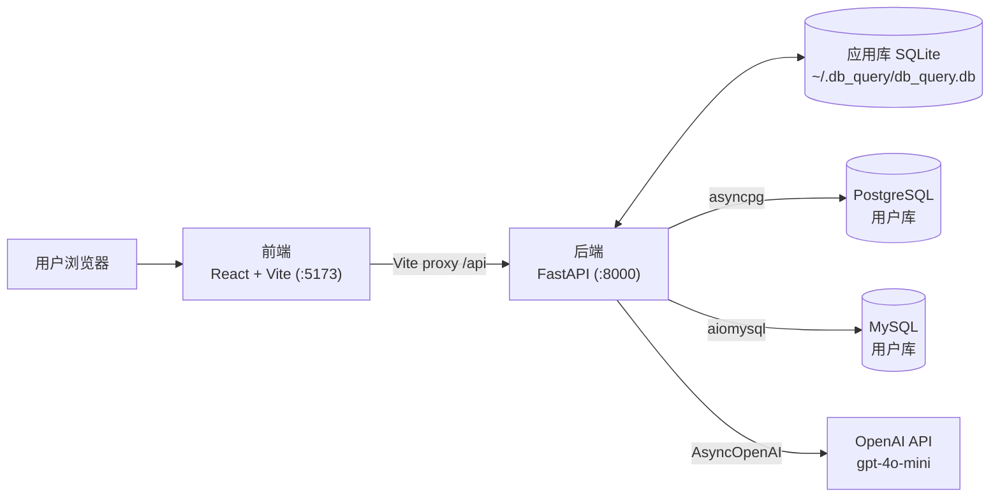
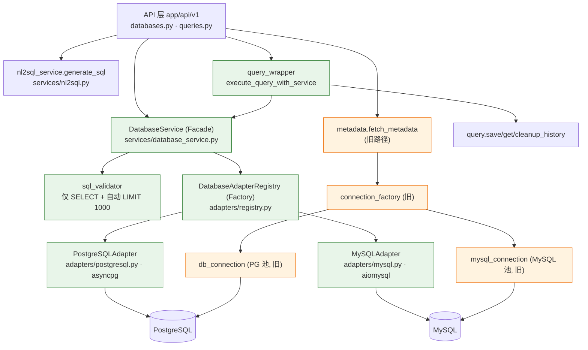
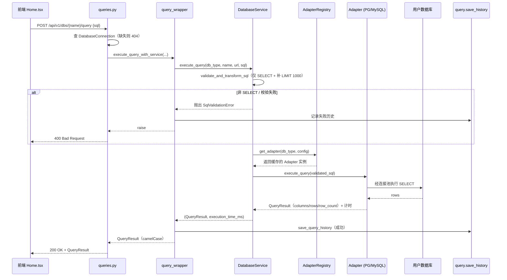
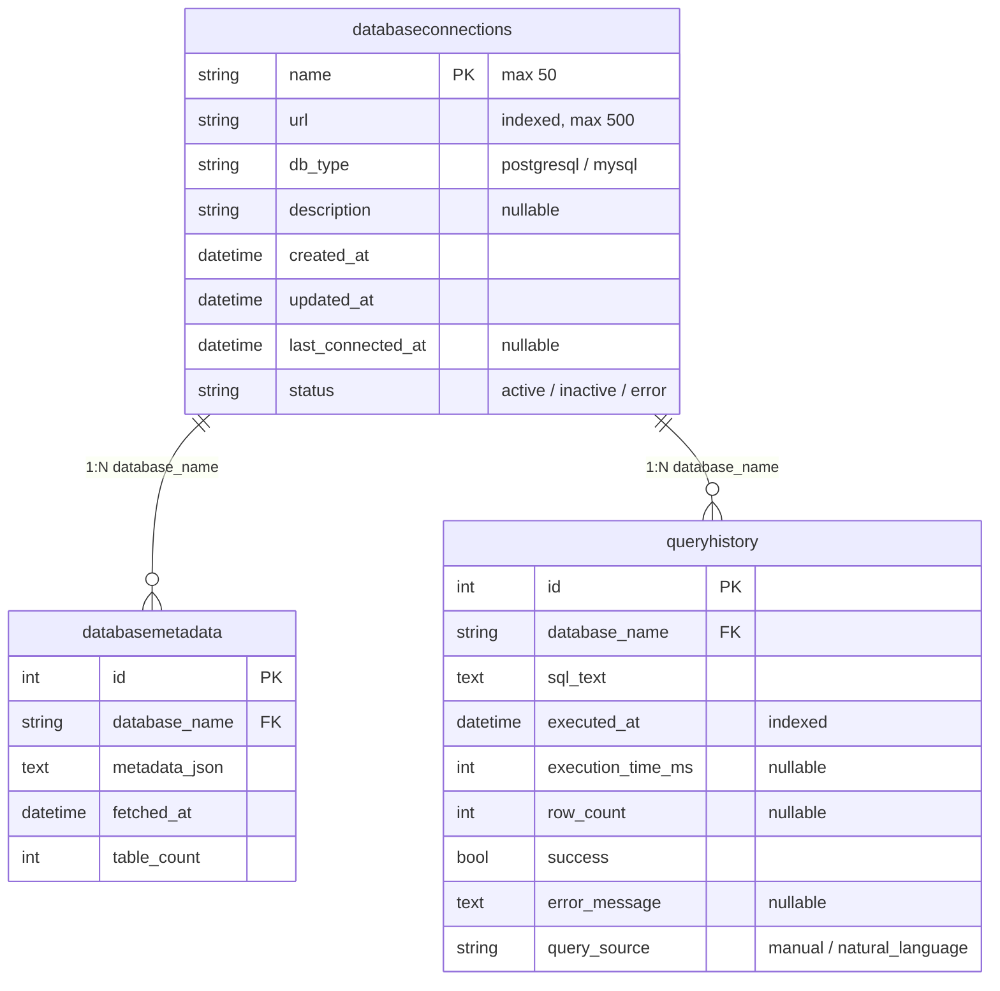

# db_query 架构与开发指南

> 一站式中文文档：项目架构、开发环境、功能模块、使用方式、快速上手。
> 所有命令、路径、API、专有名词保留英文，便于直接对照源码。
>
> **关于本文中的架构图**：采用 [Mermaid](https://mermaid.js.org/) 语法。
> - GitHub / GitLab：原生渲染，无需插件。
> - VSCode：内置 Markdown Preview 默认**不**渲染 Mermaid，请安装扩展 _Markdown Preview Mermaid Support_，或使用 _GitHub Markdown Preview_ 扩展。
> - 每张关键图后附 **ASCII 备份**，无 Mermaid 渲染环境时也可阅读。
>
> 本文事实均依据源码与实际运行环境核实（截至初始提交 `493b974`），关键处给出 `文件:行` 引用。

---

## 目录

1. [项目简介](#1-项目简介)
2. [快速上手](#2-快速上手)
3. [开发语言与开发环境](#3-开发语言与开发环境)
4. [整体架构](#4-整体架构)
5. [功能模块详解](#5-功能模块详解)
6. [数据模型](#6-数据模型)
7. [使用方式](#7-使用方式)
8. [开发环境搭建（Linux + SSH）](#8-开发环境搭建linux--ssh)
9. [开发环境搭建（Windows 10 与 WSL Ubuntu）](#9-开发环境搭建windows-10-与-wsl-ubuntu)
10. [扩展与维护](#10-扩展与维护)
11. [相关文档索引](#11-相关文档索引)
12. [附录：最小启动自检清单](#12-附录最小启动自检清单)

---

## 1. 项目简介

**db_query** 是一个自托管的**数据库探索 / 查询工作台**（Database Query Tool）。你注册 PostgreSQL / MySQL 的连接，浏览其 Schema（表 / 视图 / 列），执行**只读 SELECT** 查询，并可通过 OpenAI 用**自然语言（中英文）生成 SQL**。

### 两大组件

| 组件 | 目录 | 技术栈 |
|---|---|---|
| 后端 | `backend/` | Python 3.12 + FastAPI + SQLModel + asyncpg / aiomysql + sqlglot + OpenAI SDK |
| 前端 | `frontend/` | React 18 + TypeScript + Vite 7 + Ant Design 5 + Monaco Editor（+ Refine 5，备用） |

### 核心能力

- **连接管理**：注册 / 更新 / 删除数据库连接，保存前先测试连通性，URL 自动识别数据库类型。
- **Schema 元数据浏览**：抽取表 / 视图 / 列信息，**24 小时缓存**，可强制刷新。
- **只读 SQL 查询**：sqlglot 校验**仅允许 SELECT**，自动补 `LIMIT 1000`，结果可导出 CSV / JSON。
- **自然语言转 SQL（NL2SQL）**：基于缓存的 Schema 上下文，调用 `gpt-4o-mini` 生成 SQL + 解释。
- **查询历史**：每次执行（成功或失败）都落库，每个连接保留最近 **50** 条。

### 两类“数据库”请勿混淆

1. **应用自身的库**：本地 SQLite 文件，默认 `~/.db_query/db_query.db`，存放连接、元数据缓存、查询历史。
2. **被查询的用户数据库**：通过 URL 注册的 PostgreSQL / MySQL，应用在运行时连接它们执行查询。

---

## 2. 快速上手

> 目标：从零到“能在浏览器里跑通一条 SELECT”。只想复制命令的，按 2.1 → 2.2 → 2.3 顺序执行即可。
> 详细的环境变量、SSH 转发、排错见 [第 8 节](#8-开发环境搭建linux--ssh)；语言/OS/编辑工具见 [第 3 节](#3-开发语言与开发环境)。

### 2.1 环境搭建（最短路径）

前置：Python 3.12、Node ≥20、`uv` 已安装（openEuler 默认 Python 是 3.9，**需先装 3.12**，见 [3.2](#32-操作系统推荐) / [8.2](#82-安装运行时)）。

```bash
cd /code/db_query

# 1) 安装前后端依赖
make install          # = backend: uv sync --extra dev   +   frontend: npm install

# 2) 配置环境变量（OPENAI_API_KEY 必填，否则后端启动即崩）
cp backend/.env.example backend/.env           # 编辑后填入 OPENAI_API_KEY=sk-...
cp frontend/.env.local.example frontend/.env.local

# 3) 应用库迁移（SQLite，自动创建在 ~/.db_query/）
make setup            # = install + alembic upgrade head
```

### 2.2 软件启动

```bash
make dev              # 同时启动前后端（一个终端，Ctrl-C 同时停止）
# 或分两个终端分别启动：
make dev-backend      # 后端  http://localhost:8000  （Swagger: /docs）
make dev-frontend     # 前端  http://localhost:5173
```

启动成功标志：
- 后端日志出现 `Uvicorn running on http://0.0.0.0:8000`。
- 前端日志出现 Vite `Local: http://localhost:5173/`。
- 浏览器打开 `http://localhost:5173` 能看到主界面（左栏连接、中栏 Schema、右栏 SQL 编辑器）。

> 通过 VSCode Remote-SSH 时，5173 / 8000 端口会自动转发到本地；若未转发见 [8.7](#87-通过-ssh-远程访问vscode-remote-ssh)。

### 2.3 快速功能验证

按从简到繁的顺序逐项验证：

```bash
# ① 健康检查
curl http://localhost:8000/health
# 期望： {"status":"healthy","version":"1.0.0"}

# ② （可选）准备一个 MySQL 样例库（需本机 MySQL + root 无密码）
cd backend/scripts && bash setup_interview_db.sh && cd -

# ③ 注册一个连接（此处用上面的样例库；按你的实际库改 URL）
curl -X PUT http://localhost:8000/api/v1/dbs/mydb \
  -H "Content-Type: application/json" \
  -d '{"url":"mysql://root@localhost:3306/interview_db"}'
# 期望： 返回 JSON，status=active（后端会先测连通再落库）

# ④ 拉取/查看元数据（表/视图/列）
curl http://localhost:8000/api/v1/dbs/mydb

# ⑤ 执行一条只读查询
curl -X POST http://localhost:8000/api/v1/dbs/mydb/query \
  -H "Content-Type: application/json" \
  -d '{"sql":"SELECT COUNT(*) AS n FROM candidates"}'
# 期望： 返回 columns + rows + rowCount
```

也可直接在 `http://localhost:5173` 的 UI 里：添加连接 → 浏览 Schema → 写 SQL（或自然语言生成）→ 执行 → 查看结果 / 导出。最快的端到端验证用 UI 即可。

---

## 3. 开发语言与开发环境

### 3.1 开发语言与版本

| 语言 / 运行时 | 版本要求 | 用途 | 来源 |
|---|---|---|---|
| **Python** | **3.12+**（硬性） | 后端全部逻辑 | `backend/.python-version`、`pyproject.toml`（`requires-python = ">=3.12"`） |
| **TypeScript** | 5.9 | 前端全部代码 | `frontend/package.json` |
| **JavaScript（Node）** | ≥ 20（Vite 7 要求 20.19+ / 22.12+） | 前端构建与开发服务器 | 推断（仓库无 `.nvmrc`） |
| **SQL** | PostgreSQL / MySQL 方言 | 查询与校验（sqlglot 按方言解析） | `services/sql_validator.py` |

### 3.2 操作系统推荐

> 结论：两种都受支持，按场景选择——
> - **想在服务器上原生开发**：openEuler 22.03 SP4（需自行装 Python 3.12，见 [第 8 节](#8-开发环境搭建linux--ssh)）。
> - **不想改动 openEuler 的系统 Python / 偏好 Windows 桌面**：**Windows 10 + WSL2 Ubuntu 24.04**（自带 Python 3.12、与宿主隔离，见 [第 9 节](#9-开发环境搭建windows-10-与-wsl-ubuntu)）——**这是不碰 openEuler 的推荐方式**。

**推荐：openEuler 22.03 LTS SP4**

理由：

1. **环境就绪**：当前已通过 VSCode Remote-SSH 在该机器上开发，无需迁移。
2. **依赖更顺**：后端依赖 `sqlglot[rs]`（含 **Rust 扩展**）、`asyncpg` 等 C/Rust 扩展，在 Linux 上用 gcc 直接编译；`asyncpg` 在 Windows 上偶发事件循环兼容问题。
3. **工具链原生**：`Makefile` 与 `grep`/`find`/`curl`/`bash` 等 Unix 工具原生可用；Windows 需 WSL 或 Git Bash 才能跑 `make`。
4. **与部署一致**：项目无 Docker、无 CI，按裸机/进程部署，Linux 开发即生产同构。
5. **Node 工具链稳定**：Vite/npm 在 Linux 上表现更稳。

⚠️ **openEuler 注意事项**：

- **默认 Python 是 3.9.9**（实测），**不满足 3.12 要求**，必须自行安装 Python 3.12（源码编译或 pyenv）。本机当前 gcc 10.3.1、OpenSSL 1.1.1wa，可满足编译 3.12 的条件。安装步骤见 [8.2](#82-安装运行时)。
- 本机当前**未安装** `uv` 与 `node`，需按 [8.2](#82-安装运行时) 安装。

**备选：Windows 10 + WSL2 Ubuntu（适合不想改动 openEuler 的场景）**

在 Windows 上用 WSL2 跑 Ubuntu 24.04，**自带 Python 3.12、与 Windows 宿主及 openEuler 完全隔离**，无需改动任何机器的系统 Python：

- `wsl --install -d Ubuntu-24.04` 安装（需 Win10 2004 / build 19041+）；Ubuntu 24.04 默认 `python3` 即 3.12。
- 在 WSL Ubuntu 内用 `make` / `uv` / `npm` 开发，体验与原生 Linux 一致；浏览器经 localhost 自动转发访问。
- 代码放在 WSL 文件系统（`~/`），勿放 `/mnt/c`。
- 完整步骤见 [第 9 节](#9-开发环境搭建windows-10-与-wsl-ubuntu)。

> 原生 Windows（不装 WSL）也可用，但需另装 Python 3.12 / uv / Node、处理 `sqlglot[rs]` 编译且无 `make`，见 [9.8](#98-原生-windows备选)。

### 3.3 编辑工具（IDE）

**首选：VSCode + Remote-SSH**（当前已用，远程开发体验最佳）。

推荐扩展：

| 分类 | 扩展 | 说明 |
|---|---|---|
| 远程 | **Remote - SSH**、Remote Explorer | 连接 openEuler 开发机（已用） |
| 后端 | **Python**、**Pylance**、**Ruff** | Python 语言/类型/lint（与项目 ruff 配套） |
| 后端 | SQLite Viewer / SQLite3 Editor | 直接查看 `~/.db_query/db_query.db` |
| 前端 | **ESLint**、Prettier、**Tailwind CSS IntelliSense** | 前端 lint/格式/类名补全 |
| 通用 | **REST Client** | 跑 `fixtures/test.rest` 里的接口用例 |
| 通用 | **Markdown Preview Mermaid Support** | 渲染本文的 Mermaid 架构图 |
| 通用 | **Makefile Tools**、GitLens、EditorConfig | 任务/版本/编辑规范 |

备选 IDE：**PyCharm Professional**（后端，含 FastAPI/数据库工具）、**WebStorm**（前端）、**Cursor**。功能等价，按团队习惯选择。

### 3.4 工具链一览

| 工具 | 角色 |
|---|---|
| **uv** | Python 包管理与运行（Makefile 用 `uv sync` / `uv run`） |
| **npm** | 前端包管理（Makefile 用 npm；注意仓库同时存在 `yarn.lock`，建议删除以免漂移） |
| **Vite 7** | 前端开发服务器与构建（`/api` 代理到 :8000） |
| **ruff** | 后端 lint + format（line-length 100） |
| **mypy** | 后端类型检查（strict） |
| **pytest** | 后端测试（`asyncio_mode=auto`） |
| **ESLint / Vitest** | 前端 lint / 测试 |
| **Alembic** | 应用库（SQLite）迁移 |
| **sqlglot** | SQL 解析、校验、方言转换、自动 LIMIT |
| **Make** | 统一任务编排（`make help` 查看全部） |

---

## 4. 整体架构

### 4.1 顶层目录结构

```
db_query/
├── Makefile                     # 统一的开发任务入口（install/dev/test/migrate...）
├── README.md                    # 根说明（较简略）
├── PHASE3_IMPLEMENTATION.md     # Phase 3（NL + 导出）实现记录
├── backend/                     # FastAPI 后端
│   ├── app/
│   │   ├── main.py              # FastAPI 入口
│   │   ├── config.py            # Pydantic Settings（环境变量）
│   │   ├── database.py          # SQLite 引擎 + 会话
│   │   ├── api/v1/              # 路由：databases.py、queries.py
│   │   ├── adapters/            # 新适配器层：base / registry / postgresql / mysql
│   │   ├── services/            # 业务逻辑（新 Facade + 旧 module 并存）
│   │   ├── models/              # SQLModel 表 + Pydantic schemas（camelCase）
│   │   └── utils/db_parser.py   # 从 URL 识别数据库类型
│   ├── alembic/                 # 数据库迁移
│   ├── scripts/                 # MySQL 样例库 interview_db（建库 + 种子数据）
│   ├── tests/unit/              # pytest 单测
│   ├── pyproject.toml           # 依赖与工具配置（ruff/mypy/pytest）
│   ├── uv.lock                  # uv 锁文件
│   └── .env.example
├── frontend/                    # React 前端
│   ├── src/
│   │   ├── main.tsx             # React 入口
│   │   ├── App.tsx              # Ant Design 主题 + 挂载 Home
│   │   ├── pages/Home.tsx       # 主界面（三栏布局，实际挂载）
│   │   ├── pages/databases/*    # Refine 备选页（当前未启用）
│   │   ├── pages/queries/execute.tsx
│   │   ├── components/          # DatabaseSidebar / MetadataTree / SqlEditor / NaturalLanguageInput / ResultTable
│   │   ├── services/            # api.ts（axios）、dataProvider.ts（Refine）
│   │   └── types/               # 与后端 DTO 对应的 TS 类型
│   ├── vite.config.ts           # 端口 5173 + /api 代理到 :8000
│   ├── package.json
│   └── .env.local.example
├── docs/                        # 既有架构文档（英文为主）
└── fixtures/test.rest           # VSCode REST Client 接口测试用例
```

### 4.2 系统总体架构图



ASCII 备份：

```
[用户浏览器]
     │  HTTP
     ▼
[前端 React + Vite  :5173]  ── Vite 代理 /api ──▶  [后端 FastAPI  :8000]
                                                          │
                                ┌─────────────────────────┼─────────────────────────┐
                                ▼                         ▼                         ▼
                     [应用库 SQLite]            [PostgreSQL / MySQL]         [OpenAI gpt-4o-mini]
                  ~/.db_query/db_query.db        asyncpg / aiomysql           NL → SQL
                  连接/元数据/历史                  （连接池，运行时查询）
```

### 4.3 后端分层架构图（关键：新 / 旧双实现并存）

后端目前存在**两套数据库访问实现**，这是理解本工程最重要的细节：

- **新路径（推荐，查询走这里）**：`services/database_service.py`（Facade）+ `adapters/`（ABC + Factory + Registry）。
- **旧路径（元数据仍在用）**：`services/connection_factory.py` + `services/db_connection.py` / `mysql_*.py` + `services/metadata.py`。

`docs/ARCHITECTURE_REDESIGN.md` 记录了正在进行的、把全部访问收敛到适配器模式的重构计划。



ASCII 备份（`★ 新路径` / `☆ 旧路径`）：

```
                         ┌──────────── API 层 app/api/v1 ────────────┐
                         │   databases.py            queries.py       │
                         └──┬──────────┬────────────────┬─────────────┘
                            │          │ (查询)          │ (NL→SQL)
                  (元数据)  │          ▼                 ▼
                            │     query_wrapper     nl2sql_service ──▶ OpenAI
                            │          │
                            │          ▼
   ☆ 旧路径 ←─────────────┼──── DatabaseService (★ Facade)
   metadata.fetch_metadata │          │ │
        │                  │          │ └─▶ sql_validator（仅 SELECT + 自动 LIMIT 1000）
        ▼                  │          ▼
   connection_factory      │     DatabaseAdapterRegistry (★ Factory，按 type:name 缓存实例)
   ├─ db_connection (PG)   │          ├─▶ PostgreSQLAdapter (asyncpg)  ─┐
   └─ mysql_connection     │          └─▶ MySQLAdapter (aiomysql)       ├─▶ 用户数据库
        │                  │       query.save/get/cleanup_history        │
        └──▶ extract_*_metadata                                          │
                                                                        │
   query_wrapper ──▶ save_query_history（成功/失败均落库，每库保留 50 条）┘
```

### 4.4 查询执行时序图

以 `POST /api/v1/dbs/{name}/query` 为例（参见 [queries.py:41](../backend/app/api/v1/queries.py#L41)）：



ASCII 备份：

```
前端 ──POST /{name}/query {sql}──▶ queries.execute_sql_query
                                         │ 查 DatabaseConnection（404 if 无）
                                         ▼
                              query_wrapper.execute_query_with_service
                                         │
                                         ▼
                          DatabaseService.execute_query
                                         │
                            ┌────────────┴───────────────┐
                            ▼                            ▼
                  validate_and_transform_sql     registry.get_adapter
                  (sqlglot: 仅 SELECT,                (按 type:name 缓存)
                   无 LIMIT 则补 1000)                     │
                            │                            ▼
                   失败? ──▶ SqlValidationError     adapter.execute_query
                            │  └─ 记失败历史 ──▶ 400         │ 经连接池
                                                          ▼
                                                    用户数据库
                                                          │ rows
                          ┌── 成功 ── 记成功历史 ◀── QueryResult + 计时
                          ▼
                映射为 camelCase QueryResult ──▶ 200 OK ──▶ 前端渲染表格 / 导出
```

### 4.5 设计模式

- **Adapter（适配器）**：`adapters/base.py` 的 `DatabaseAdapter` ABC，统一不同数据库的行为。
- **Factory + Registry（工厂 + 注册表）**：`adapters/registry.py` 按 `DatabaseType` 查找适配器类，并按 `"{type}:{name}"` 缓存实例。
- **Facade（外观）**：`services/database_service.py` 的 `DatabaseService` 协调适配器、校验器等。
- **模块级单例服务**：`database_service`、`adapter_registry`、`nl2sql_service` 均为模块级全局实例。
- **依赖注入**：FastAPI 通过 `get_session`（[database.py](../backend/app/database.py)）注入 SQLite 会话。

---

## 5. 功能模块详解

所有接口前缀均为 `/api/v1/dbs`（两个 router 都是，见 [databases.py:19](../backend/app/api/v1/databases.py#L19)、[queries.py:23](../backend/app/api/v1/queries.py#L23)）。

### 5.1 连接管理

- **创建 / 更新**：`PUT /api/v1/dbs/{name}`（[databases.py:36](../backend/app/api/v1/databases.py#L36)）
  - 名称仅允许字母数字、`-`、`_`。
  - `db_type` 可不传，由 URL scheme 自动识别（`utils/db_parser.py`）；若传入则需与 URL 一致。
  - **落库前先调用 `database_service.test_connection` 测试连通**，失败返回 400。
- **列表**：`GET /api/v1/dbs`（[databases.py:123](../backend/app/api/v1/databases.py#L123)）。
- **删除**：`DELETE /api/v1/dbs/{name}`（[databases.py:199](../backend/app/api/v1/databases.py#L199)），同时关闭对应连接池。

### 5.2 元数据提取与缓存

- **获取**：`GET /api/v1/dbs/{name}`（[databases.py:141](../backend/app/api/v1/databases.py#L141)），可带 `?refresh=true` 强制刷新。
- **强制刷新**：`POST /api/v1/dbs/{name}/refresh`（[databases.py:231](../backend/app/api/v1/databases.py#L231)）。
- 数据来源：PostgreSQL 走 `pg_tables` / `information_schema`；MySQL 走 `INFORMATION_SCHEMA`。
- **缓存**：抽取结果以 JSON 存入 `databasemetadata` 表，**24 小时**过期（`DatabaseMetadata.is_stale`，[metadata.py:22](../backend/app/models/metadata.py#L22)）。
- ⚠️ 元数据走的是**旧路径**（`services/metadata.py` + `connection_factory.py`）。

### 5.3 查询执行

- 端点：`POST /api/v1/dbs/{name}/query`（[queries.py:41](../backend/app/api/v1/queries.py#L41)），body `{"sql": "..."}`。
- **只读安全**：`services/sql_validator.py` 用 sqlglot 解析，**仅允许 SELECT**（`isinstance(parsed, exp.Select)`），否则抛 `SqlValidationError` → 400。
- **自动 LIMIT**：无 `LIMIT` 时自动追加 `LIMIT 1000`（`query_default_limit`）。
- 连接池：min 1 / max 5 / command timeout 60s（`config.py`）。
- 结果类型推断：PG 由首行 Python 值推断；MySQL 由 `cursor.description` + 类型码映射。
- 走**新路径**：`query_wrapper` → `DatabaseService` → 适配器。

### 5.4 自然语言转 SQL

- 端点：`POST /api/v1/dbs/{name}/query/natural`（[queries.py:127](../backend/app/api/v1/queries.py#L127)），body `{"prompt": "..."}`（5–500 字符）。
- **前置条件**：必须已有缓存元数据，否则返回 404 “请先刷新元数据”。
- 调用 `nl2sql_service.generate_sql`（[nl2sql.py](../backend/app/services/nl2sql.py)）：模型 `gpt-4o-mini`，`temperature=0.1`，`max_tokens=500`，构造含 Schema 上下文、按方言（postgres / mysql）的系统提示，返回 `{sql, explanation}`。
- **前端不会自动执行**生成的 SQL，而是填入编辑器、切到手动 Tab 由用户确认后执行。

### 5.5 查询历史

- 端点：`GET /api/v1/dbs/{name}/history?limit=50`（[queries.py:93](../backend/app/api/v1/queries.py#L93)）。
- 成功 / 失败均落库（`query_wrapper` 中三种分支都会 `save_query_history`），每个连接裁剪保留最近 50 条（`query_history_retention`）。

### 5.6 API 端点速查表

| Method | Path | 处理函数（文件:行） | 用途 |
|---|---|---|---|
| GET | `/health` | `main.py:34` | 健康检查 |
| PUT | `/api/v1/dbs/{name}` | `databases.py:36` | 创建/更新连接（先测连通） |
| GET | `/api/v1/dbs` | `databases.py:123` | 列出所有连接 |
| GET | `/api/v1/dbs/{name}` | `databases.py:141` | 获取元数据（`?refresh=true`） |
| POST | `/api/v1/dbs/{name}/refresh` | `databases.py:231` | 强制刷新元数据 |
| DELETE | `/api/v1/dbs/{name}` | `databases.py:199` | 删除连接（关闭连接池） |
| POST | `/api/v1/dbs/{name}/query` | `queries.py:41` | 执行 SELECT（自动 LIMIT 1000） |
| GET | `/api/v1/dbs/{name}/history` | `queries.py:93` | 查询历史（默认 50 条） |
| POST | `/api/v1/dbs/{name}/query/natural` | `queries.py:127` | 自然语言 → SQL |

> 自动生成的 OpenAPI 文档：`http://localhost:8000/docs`。

---

## 6. 数据模型

应用自身 SQLite 库有 3 张表（SQLModel 定义，Alembic 初始迁移见 [alembic/versions/001_initial_schema.py](../backend/alembic/versions/001_initial_schema.py)）。

### 6.1 ER 图



### 6.2 表说明

- **`databaseconnections`**（[models/database.py:23](../backend/app/models/database.py#L23)）：以 `name` 为主键，`url` 建索引。`db_type` 为枚举 `postgresql | mysql`，`status` 为 `active | inactive | error`。
- **`databasemetadata`**（[models/metadata.py:8](../backend/app/models/metadata.py#L8)）：`metadata_json`（Text）存抽取到的 Schema JSON，`fetched_at` 用于 24h 过期判断。
- **`queryhistory`**（[models/query.py:16](../backend/app/models/query.py#L16)）：`executed_at` 建索引；`query_source` 为 `manual | natural_language`。

### 6.3 API DTO 与前端类型

- 后端 Pydantic schema（[models/schemas.py](../backend/app/models/schemas.py)）统一 **camelCase** 别名（如 `db_type → dbType`、`row_count → rowCount`），由 `models/__init__.py` 的全局配置驱动。
- 前端 TS 类型（`frontend/src/types/`：`database.ts` / `metadata.ts` / `query.ts`）与之逐一对应。

> ⚠️ **安全提示**：连接 URL（可能含密码）以**明文**存储于 `databaseconnections.url` 列。生产环境请评估风险并考虑加密或使用密钥管理。

---

## 7. 使用方式

### 7.1 启动后访问

- 前端：`http://localhost:5173`（开发态，Vite 把 `/api` 代理到后端 `:8000`，见 [vite.config.ts](../frontend/vite.config.ts)）。
- Swagger / OpenAPI 文档：`http://localhost:8000/docs`。
- 健康检查：`http://localhost:8000/health`。

### 7.2 UI 操作流程（[pages/Home.tsx](../frontend/src/pages/Home.tsx) 三栏布局）

1. **左栏 DatabaseSidebar**：添加 / 选择 / 删除连接。
2. **中栏 MetadataTree**：浏览选中库的表 / 视图 / 列（可过滤）。
3. **右栏**：上方指标行；下方 Tab 切换 **SQL 编辑器（Monaco）** 与 **自然语言输入**；执行后展示结果表，支持 CSV / JSON 导出（>10k 行有确认提示）。

典型路径：添加连接 → 浏览 Schema → 手写或用自然语言生成 SQL → 执行 → 查看 / 导出结果。

### 7.3 体验样例数据

`backend/scripts/` 内置一套 MySQL 样例库 `interview_db`（12 张表，模拟招聘流水线）：

```bash
cd backend/scripts && bash setup_interview_db.sh   # 需本地 MySQL + root 无密码
# 之后在应用里注册连接，例如：mysql://root@localhost:3306/interview_db
```

详见 `backend/scripts/INTERVIEW_DB_README.md`。

### 7.4 API 手动测试

`fixtures/test.rest` 提供约 30 条 VSCode REST Client 用例（覆盖 PostgreSQL / MySQL 及中英文 NL）。安装 _REST Client_ 扩展后，在文件里点 “Send Request” 即可。

### 7.5 关键 Make 目标速查

| 命令 | 作用 |
|---|---|
| `make install` | 安装前后端依赖（`uv sync --extra dev` + `npm install`） |
| `make setup` | install + 执行 Alembic 迁移 |
| `make dev` | 同时启动前后端（并行） |
| `make dev-backend` | 仅后端（uvicorn `:8000`，`--reload`） |
| `make dev-frontend` | 仅前端（Vite `:5173`） |
| `make health` | 检查后端 `/health` |
| `make docs` | 打开 `/docs` |
| `make test` | 跑后端 pytest + 前端 vitest |
| `make test-backend-coverage` | 后端测试 + 覆盖率报告 |
| `make lint` / `make format` | ruff + eslint 检查 / 格式化 |
| `make backend-check` | mypy + ruff（后端） |
| `make db-upgrade` / `db-migrate MSG=...` / `db-downgrade REV=...` | Alembic 迁移 |
| `make ci` | install + lint + test（最接近 CI 的本地命令） |

> 完整列表：`make help`。

---

## 8. 开发环境搭建（Linux + SSH）

> 本章是**第 2 节快速上手**的深度参考：运行时安装、环境变量全表、SSH 转发、排错与常见坑。
> 当前环境：**openEuler 22.03 LTS SP4**，VSCode 通过 Remote-SSH 连接。

### 8.1 前置条件

| 依赖 | 版本要求 | 当前机器状态 |
|---|---|---|
| Python | **3.12**（`backend/.python-version`，`pyproject.toml` 要求 `>=3.12`） | ⚠️ 默认 3.9.9，**需装 3.12** |
| Node.js | **≥ 20**（仓库无 `.nvmrc`；Vite 7 要求 20.19+ / 22.12+） | ⚠️ 未安装 |
| uv | 最新（Python 包管理器，Makefile 用 `uv`） | ⚠️ 未安装 |
| make / git | 系统自带（make 4.3 ✓） | ✓ |
| gcc / OpenSSL | 用于编译 Python 3.12 | ✓ gcc 10.3.1、OpenSSL 1.1.1wa |
| （可选）MySQL / PostgreSQL | 任意 | 用于体验真实查询；不装也能启动应用（应用库是 SQLite） |

### 8.2 安装运行时

```bash
# ---- 1) 安装 Python 3.12（openEuler 默认 3.9，需源码编译）----
sudo dnf install -y gcc make openssl-devel libffi-devel zlib-devel \
                    bzip2-devel readline-devel sqlite-devel xz-devel
cd /tmp
curl -O https://www.python.org/ftp/python/3.12.7/Python-3.12.7.tgz
tar xzf Python-3.12.7.tgz && cd Python-3.12.7
./configure --enable-optimizations --prefix=/usr/local
make -j$(nproc)
sudo make install           # 产出 /usr/local/bin/python3.12
python3.12 --version        # 验证

# ---- 2) 安装 uv（后端包管理器）----
curl -LsSf https://astral.sh/uv/install.sh | sh
# 确保 PATH： export PATH="$HOME/.local/bin:$PATH"（按提示写入 ~/.bashrc）
uv --version

# ---- 3) 安装 Node ≥ 20（推荐 nvm）----
curl -o- https://raw.githubusercontent.com/nvm-sh/nvm/v0.40.1/install.sh | bash
source ~/.bashrc
nvm install 20 && nvm use 20
node --version
```

> 备注：openEuler 也可用 `pyenv` 管理 Python 多版本；若 dnf 仓库（EPOL）提供 `python3.12`，也可 `sudo dnf install python3.12` 后跳过源码编译。

### 8.3 安装项目依赖

```bash
cd /code/db_query
make install        # = cd backend && uv sync --extra dev   +   cd frontend && npm install
```

### 8.4 配置环境变量

```bash
# 后端（必填 OPENAI_API_KEY，否则 backend 启动即崩溃）
cp backend/.env.example backend/.env
# 编辑 backend/.env，填入：OPENAI_API_KEY=sk-...

# 前端
cp frontend/.env.local.example frontend/.env.local
```

**后端环境变量**（[config.py](../backend/app/config.py)，均可选，除 `OPENAI_API_KEY` 外均有默认值）：

| 变量 | 默认值 | 说明 |
|---|---|---|
| `OPENAI_API_KEY` | **（无，必填）** | NL2SQL 用；缺失则 `Settings()` 实例化即报错 |
| `DB_QUERY_DATA_DIR` | `~/.db_query` | 应用 SQLite 库目录 |
| `LOG_LEVEL` | `INFO` | 日志级别 |
| `CORS_ORIGINS` | `*` | 跨域，逗号分隔 |
| `QUERY_DEFAULT_LIMIT` | `1000` | 自动补的 LIMIT 值 |
| `QUERY_HISTORY_RETENTION` | `50` | 每库保留历史条数 |
| `DB_POOL_MIN_SIZE` / `DB_POOL_MAX_SIZE` | `1` / `5` | 连接池大小 |
| `DB_POOL_COMMAND_TIMEOUT` | `60` | 命令超时（秒） |
| `METADATA_CACHE_HOURS` | `24` | 元数据缓存时长（小时） |

**前端环境变量**（`frontend/.env.local`）：

| 变量 | 默认值 | 说明 |
|---|---|---|
| `VITE_API_BASE_URL` | `http://localhost:8000/api/v1` | axios baseURL（`services/api.ts`） |

### 8.5 数据库迁移（应用库 = SQLite，自动创建）

```bash
make setup          # = install + alembic upgrade head
# 或单独迁移：
make db-upgrade
```

> 说明：`init_db()`（[database.py](../backend/app/database.py)）在启动时也会 `SQLModel.metadata.create_all`，所以即使不跑迁移也能用；Alembic 是“正规”的 Schema 演进路径。

### 8.6 启动开发服务器

```bash
make dev            # 同时启动前后端（一个终端，Ctrl-C 同时停）
# 或分两个终端：
make dev-backend    # http://localhost:8000 （/docs 可用）
make dev-frontend   # http://localhost:5173
```

### 8.7 通过 SSH 远程访问（VSCode Remote-SSH）

- VSCode Remote-SSH 会**自动转发**被监听的端口，本地浏览器可直接访问 `http://localhost:5173` / `http://localhost:8000/docs`。
- 若自动转发未生效，可在本地终端做端口转发：
  ```bash
  ssh -L 5173:localhost:5173 -L 8000:localhost:8000 user@<远程主机>
  ```

### 8.8 测试与代码质量

```bash
make test                  # 后端 pytest + 前端 vitest
make test-backend-coverage # 后端测试 + 覆盖率（htmlcov/）
make lint                  # ruff（后端） + eslint（前端）
make format                # ruff format + eslint --fix
make backend-check         # mypy + ruff（后端）
```

### 8.9 常见坑（Gotchas）

1. **缺 `OPENAI_API_KEY` → backend 启动即崩**。`config.py` 中该字段无默认值，`Settings()` 实例化时即抛错。若暂不需要 NL2SQL，也需填一个占位值才能启动。
2. **Python 必须 3.12**。openEuler 默认 3.9，`make install`（`uv sync`）会因 `requires-python>=3.12` 失败——先按 [8.2](#82-安装运行时) 装 3.12，并确保 `python3.12` 可用。
3. **前端存在两个锁文件**（`package-lock.json` + `yarn.lock`）。Makefile 与文档使用 **npm**，建议删除 `yarn.lock` 以免依赖漂移。
4. **无 Node 版本锁定**。请自行确保 Node ≥ 20（Vite 7 的要求）。
5. **`make docs` 的 `open` 仅 macOS**；Linux 会回退到 `xdg-open`，无图形界面时仅打印 URL，手动打开 `http://localhost:8000/docs` 即可。
6. **`make clean-db` 会删除 `~/.db_query/db_query.db`**（所有连接 / 历史），执行前有 `y/N` 二次确认。
7. **无 Docker、无 CI 配置**。部署为裸机 / 进程方式；`make ci` 是最接近 CI 的本地命令。
8. **应用启动**：`main.py` 在导入时与 `startup` 事件中都会调用 `init_db()`；`shutdown` 时关闭旧路径的 PG 连接池（`close_all_connection_pools`）。

---

## 9. 开发环境搭建（Windows 10 与 WSL Ubuntu）

> **推荐在 Windows 10 上用 WSL2 + Ubuntu 24.04 开发**。整套运行时（Python 3.12、Node、uv）都装在 WSL Ubuntu 内，**与 Windows 宿主、也与你的 openEuler 机器完全隔离——无需改动 openEuler 的系统 Python**。
> 原生 Windows（不装 WSL）仅作轻量备选，见 [9.8](#98-原生-windows备选)。

### 9.1 前置要求

- **Windows 10 版本 2004（内部版本 19041）或更高**——这是一键 `wsl --install` 的门槛；更旧的版本走 [9.2 方式二](#92-安装-wsl2--ubuntu-2404自带-python-312) 的手动路径。用 `winver` 查版本。
- BIOS 中启用 CPU 虚拟化（Intel VT-x / AMD-V）。
- 以下 PowerShell 命令均以**管理员身份**运行。

### 9.2 安装 WSL2 + Ubuntu 24.04（自带 Python 3.12）

**方式一：Win10 2004+（推荐，一条命令）**

```powershell
# 管理员 PowerShell
wsl --install -d Ubuntu-24.04     # 一键：启用 WSL2 + 虚拟机平台 + 安装 Ubuntu 24.04 LTS
# 重启电脑；首次启动 Ubuntu 时设置 UNIX 用户名 / 密码
wsl --update                       # 确保 WSL 组件最新（systemd 等需 ≥ 0.67.6）
wsl -l -v                          # 应看到 Ubuntu-24.04   VERSION 2
wsl --set-default Ubuntu-24.04
```

> **为什么选 Ubuntu 24.04**：其默认 `python3` 即 **3.12**（apt 直装，免源码编译）。
> 裸 `wsl --install`（不带 `-d`）装的是滚动版 Ubuntu，不保证 3.12，故务必显式指定 `Ubuntu-24.04`。
> 若下载卡在 0.0%：`wsl --install --web-download -d Ubuntu-24.04`。

**方式二：Win10 旧版本（< 2004，手动启用）**

```powershell
# 管理员 PowerShell
dism.exe /online /enable-feature /featurename:Microsoft-Windows-Subsystem-Linux /all /norestart
dism.exe /online /enable-feature /featurename:VirtualMachinePlatform /all /norestart
# ↓ 重启电脑 ↓
# 下载并安装 WSL2 内核更新 MSI： https://aka.ms/wsl2kernel
wsl --set-default-version 2
# 然后从 Microsoft Store 安装 Ubuntu 24.04 LTS，首次启动设置用户名 / 密码
```

**（可选）启用 systemd**（便于 `systemctl` 跑 MySQL 等服务；Win10 需 Store 版 WSL ≥ 0.67.6，`wsl --update` 即可满足）。在 Ubuntu 内编辑 `/etc/wsl.conf`：

```ini
[boot]
systemd=true
```

随后在 Windows 侧 `wsl --shutdown` 再重开 Ubuntu 生效，用 `systemctl status` 验证。

**（可选）限制 WSL 资源**：Windows 侧新建 `%UserProfile%\.wslconfig`：

```ini
[wsl2]
memory=8GB
processors=4
```

> 改 `/etc/wsl.conf` 或 `.wslconfig` 后，**都必须 `wsl --shutdown` 再重开**才生效（约 8 秒“完全停止”规则）。

### 9.3 在 Ubuntu 内安装运行时

> 以下全部在 WSL Ubuntu 内执行，与 Windows 宿主、openEuler 完全隔离。

```bash
# 系统包：Python 3.12 + 构建工具（Ubuntu 24.04 默认 python3 已是 3.12）
sudo apt update && sudo apt install -y build-essential make git curl \
    python3.12 python3.12-venv python3.12-dev
python3.12 --version            # 应为 3.12.x
# ⚠️ python3.12-venv 必装，否则 python3 -m venv 会报 "ensurepip is not available"

# uv（后端包管理器）
curl -LsSf https://astral.sh/uv/install.sh | sh
# 按提示把 ~/.local/bin 写入 PATH（~/.bashrc），然后：
source ~/.bashrc
uv --version

# Node ≥ 20（Vite 7 要求；用 nvm）
curl -o- https://raw.githubusercontent.com/nvm-sh/nvm/v0.40.1/install.sh | bash
source ~/.bashrc
nvm install 20 && nvm use 20
node --version                  # v20.x
```

**（可选）本地 MySQL**（用于跑样例库 `interview_db`）：

```bash
sudo apt install -y mysql-server
sudo service mysql start        # 未启用 systemd 时；启用后可用 sudo systemctl start mysql
mysql --version
```

### 9.4 获取代码 + VSCode（WSL）连接

```bash
# 代码务必放在 WSL 文件系统（~/），不要放 /mnt/c（跨 9P/virtiofs 很慢，且 NTFS 大小写不敏感易致 git 出错）
cd ~
git clone <你的仓库地址> db_query        # 或： cp -r /mnt/c/path/to/db_query ~/db_query
cd ~/db_query
```

- VSCode 安装 **WSL** 扩展（旧名 Remote-WSL，ID `ms-vscode-remote.remote-wsl`）。
- 在 Ubuntu 项目目录执行 `code .`，VSCode 会以 WSL 模式打开（左下角显示 `WSL: Ubuntu-24.04`），此后终端、Python/Node、扩展都在 Linux 侧运行。

### 9.5 配置、迁移与启动（在 WSL Ubuntu 内）

直接用 Makefile（Linux 命令，原生可用；与第 8 节 Linux 步骤一致）：

```bash
cd ~/db_query
make install                                      # uv sync --extra dev + npm install
cp backend/.env.example backend/.env              # 编辑后填 OPENAI_API_KEY（必填，否则后端启动即崩）
cp frontend/.env.local.example frontend/.env.local
make setup                                        # install + alembic upgrade head
make dev                                          # 前后端并行；或分窗 make dev-backend / make dev-frontend
```

> Alembic 仅在 dev extras 中，故必须 `uv sync --extra dev`（`make install` 已含），`make db-*` 等才可用。

### 9.6 浏览器访问 / 网络互通（Win10 = NAT + localhost 自动转发）

- Win10 的 WSL2 为 NAT 模式 + 自动 localhost 转发：Windows 浏览器直接开 `http://localhost:5173` 与 `http://localhost:8000/docs` 即可（`localhostForwarding` 默认开启，19041+ 可用）。
- ⚠️ **Win10 不支持 `networkingMode=mirrored`**（Win11 22H2+ 专属）；`dnsTunneling` / `autoProxy` / `firewall` 同理仅 Win11，**不要在 Win10 配置**。
- 需要局域网内其他机器访问 WSL 服务时，Win10 须手动 `netsh interface portproxy`（高级，按需）。

### 9.7 WSL 常见坑（Gotchas）

1. **代码务必放 WSL 文件系统（`~/`）**；放 `/mnt/c` 慢 10×+，且 NTFS 大小写不敏感可能让 `git` 出错。
2. **改 `/etc/wsl.conf` 或 `.wslconfig` 后**必须 `wsl --shutdown` 再重开（约 8 秒“完全停止”规则）。
3. **systemd 需 Store 版 WSL ≥ 0.67.6**；旧 “inbox” WSL 没有，先 `wsl --update`，用 `wsl --version` 查版本。
4. **`python3.12-venv` 必装**，否则创建虚拟环境报 `ensurepip is not available`。
5. **资源占用**：用 `.wslconfig` 的 `memory=` / `processors=` 限制，防止吃满宿主机内存。
6. **系统时间漂移**：休眠后 WSL 时间可能偏，`wsl --shutdown` 重开或 `sudo hwclock -s`。
7. **端口冲突**：Windows 侧若也占用 5173 / 8000 会冲突；停其一或改端口。
8. **MySQL / 服务不自启**：未启 systemd 时 `sudo service mysql start`；启用后用 `systemctl`。
9. **彻底重置**：`wsl --shutdown`；极端情况 `wsl --unregister Ubuntu-24.04`（会删除该发行版全部数据，谨慎）。

### 9.8 原生 Windows（备选）

若不便装 WSL2：用 `winget` 或官网安装 Python 3.12 / uv / Node ≥ 20；无 `make` 时用底层命令：

| make 目标 | PowerShell 等价 |
|---|---|
| `make install` | `cd backend; uv sync --extra dev` ；`cd frontend; npm install` |
| `make setup` | install + `cd backend; uv run alembic upgrade head` |
| `make dev-backend` | `cd backend; uv run uvicorn app.main:app --reload --port 8000` |
| `make dev-frontend` | `cd frontend; npm run dev` |
| `make test-backend` | `cd backend; uv run pytest -v` |
| `make lint` | `cd backend; uv run ruff check app tests` ；`cd frontend; npm run lint` |

注意：`sqlglot[rs]` 可能需 Visual Studio Build Tools（或去掉 `[rs]` 退化纯 Python）；`backend/scripts/*.sh` 无法在原生 Windows 直接运行；asyncio 偶发需 `asyncio.set_event_loop_policy(asyncio.WindowsSelectorEventLoopPolicy())`。**绝大多数情况下推荐用上面的 WSL 路径。**

---

## 10. 扩展与维护

### 10.1 新增数据库适配器

遵循适配器模式，参考 [`backend/app/adapters/README.md`](../backend/app/adapters/README.md)：

1. 新建 `adapters/<db>.py`，继承 `DatabaseAdapter`（[base.py:68](../backend/app/adapters/base.py#L68)）。
2. 实现 7 个抽象方法：`test_connection`、`get_connection_pool`、`close_connection_pool`、`extract_metadata`、`execute_query`、`get_dialect_name`、`get_identifier_quote_char`。
3. 在 `DatabaseAdapterRegistry`（或启动时）调用 `register(DatabaseType.XXX, YourAdapter)` 注册。
4. 在 `models/database.py` 的 `DatabaseType` 枚举新增类型，并在 `utils/db_parser.py` 的 URL 识别中支持新 scheme。

### 10.2 Alembic 迁移

```bash
make db-migrate MESSAGE="描述本次变更"   # 自动生成修订
make db-upgrade                          # 应用到最新
make db-downgrade REVISION=previous      # 回滚
make db-current                          # 当前版本
make db-history                          # 历史
```

### 10.3 双实现迁移背景

查询已切到新适配器路径，但元数据仍走旧 module 路径。完整重构计划见 [`docs/ARCHITECTURE_REDESIGN.md`](ARCHITECTURE_REDESIGN.md)。

---

## 11. 相关文档索引

`docs/` 下既有文档（多为英文、偏架构设计），按需深入阅读：

| 文档 | 定位 |
|---|---|
| [docs/README.md](README.md) | 后端 setup 与结构速览（英文） |
| [docs/ARCHITECTURE_INDEX.md](ARCHITECTURE_INDEX.md) | 架构文档导航枢纽 |
| [docs/ARCHITECTURE_SUMMARY.md](ARCHITECTURE_SUMMARY.md) | 重设计高层概览 |
| [docs/ARCHITECTURE_REDESIGN.md](ARCHITECTURE_REDESIGN.md) | 完整技术规格（适配器重构、迁移路径） |
| [docs/CLASS_DIAGRAM.md](CLASS_DIAGRAM.md) | UML 类图与时序图 |
| [docs/IMPLEMENTATION_GUIDE.md](IMPLEMENTATION_GUIDE.md) | 分阶段实现计划 |
| [docs/QUICK_REFERENCE.md](QUICK_REFERENCE.md) | “新增数据库”速查卡 |
| [docs/MYSQL_SUPPORT.md](MYSQL_SUPPORT.md) | MySQL 连接与格式说明 |

> 注：`backend/IMPLEMENTATION_GUIDE.md` 当前为空文件，真实架构文档在 `docs/` 下。

---

## 12. 附录：最小启动自检清单

逐项确认后，即可成功启动：

- [ ] 已安装 **Python 3.12**（`python3.12 --version`）
- [ ] 已安装 **Node ≥ 20**（`node --version`）
- [ ] 已安装 **uv**（`uv --version`）
- [ ] `make install` 成功完成（无报错）
- [ ] `backend/.env` 存在且 **`OPENAI_API_KEY` 已填写**
- [ ] `frontend/.env.local` 存在（或使用默认值）
- [ ] `make db-upgrade` 成功（或信任 `init_db()` 自动建表）
- [ ] `make dev-backend` 后 `curl http://localhost:8000/health` 返回 `{"status":"healthy",...}`
- [ ] 浏览器访问 `http://localhost:5173` 能看到主界面
- [ ] （可选）注册一个连接并执行一条 `SELECT` 验证端到端可用
